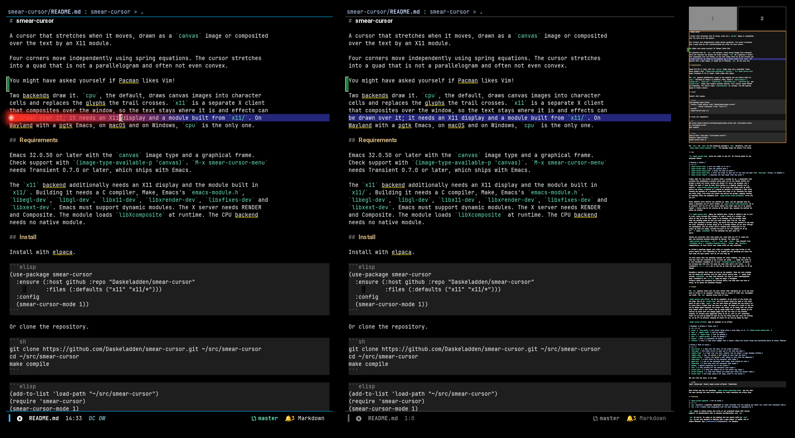
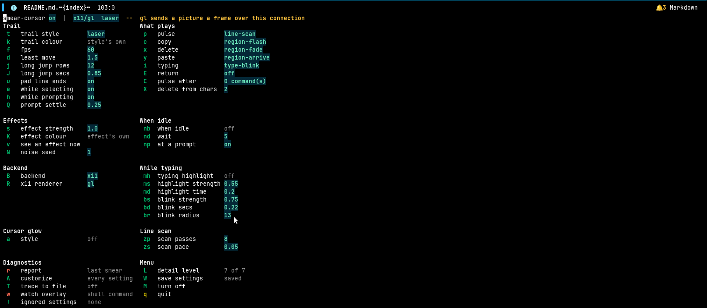

# smear-cursor

A cursor that stretches when it moves, drawn as a `canvas` image or composited
over the text by an X11 module.



Four corners move independently using spring equations. The cursor stretches
into a quad that is not a parallelogram and often not even convex.

You might have asked yourself if Pacman likes Vim!

Two backends draw it. `cpu`, the default, draws canvas images into character
cells and replaces the glyphs the trail crosses. `x11` is a separate X client
that composites over the window, so the text stays where it is and effects can
be drawn over it; it needs an X11 display and a module built from `x11/`. On
Wayland with a pgtk Emacs, on macOS and on Windows, `cpu` is the only one.

## Requirements

Emacs 32.0.50 or later with the `canvas` image type and a graphical frame.
Check support with `(image-type-available-p 'canvas)`. `M-x smear-cursor-menu`
needs Transient 0.7.0 or later, which ships with Emacs.

The `x11` backend additionally needs an X11 display and the module built in
`x11/`. Building it needs a C compiler, Make, Emacs's `emacs-module.h`,
`libegl-dev`, `libgl-dev`, `libx11-dev`, `libxrender-dev`, `libxfixes-dev` and
`libxext-dev`. Emacs must support dynamic modules. The X server needs RENDER
and Composite. The module loads `libXcomposite` at runtime. The CPU backend
needs no native module.

## Install

Install with elpaca.

```elisp
(use-package smear-cursor
  :ensure (:host github :repo "Daskeladden/smear-cursor"
           :files (:defaults ("x11" "x11/*")))
  :config
  (smear-cursor-mode 1))
```

Or clone the repository.

```sh
git clone https://github.com/Daskeladden/smear-cursor.git ~/src/smear-cursor
cd ~/src/smear-cursor
make compile
```

```elisp
(add-to-list 'load-path "~/src/smear-cursor")
(require 'smear-cursor)
(smear-cursor-mode 1)
```

For `x11`, run `make` in the installed package's `x11/` directory, then set
`(setq smear-cursor-backend 'x11)`. The package loads the module from there.

## Use

`M-x smear-cursor-mode` turns the trail on and off. It follows point in the
selected window.

| Command | Action |
|---|---|
| `smear-cursor-mode` | turn the trail on or off |
| `smear-cursor-menu` | open the options menu |
| `smear-cursor-pulse-line` | pulse the line at point |
| `smear-cursor-scan-line` | throw the trail to each end of the line and back (the `line-scan` effect, on demand) |
| `smear-cursor-report` | describe the last smear that was drawn |

Trails wait for the cursor to settle while a prompt is up. A completion that
previews its candidates — consult shows each one in the window behind the
prompt — moves the cursor across the window for every key pressed, and a
flight for each of them is what falls behind on a display reached over a
network. `smear-cursor-prompt-settle` is how long the cursor must be still
before one draws, a quarter of a second by default, so skimming a list draws
nothing and pausing on a candidate draws the trail to it. Choosing one draws
the whole jump, from where the cursor was before the prompt, because nothing
is recorded while the skimming runs. `smear-cursor-while-prompting` turns the
lot off.

Modal editing works without any setting up. Meow, and any package like it,
makes a selection out of every motion, so `smear-cursor-while-selecting` is on
by default; turn it off if you would rather the trail kept out of an active
region. A mouse drag is not covered by it either way, because the pointer is
doing the moving.

`M-x smear-cursor-menu` opens the options menu. Press an option's key to turn
it over, cycle through its choices, or edit a value at a prompt: the
value it has is in the line ready to be changed, and the prompt names
what the setting ships as when you have moved away from it. The menu
shows each setting's current value, and marks the ones the backend in use does
not draw. Choosing an effect plays it in a preview window as you move through
the candidates, and the cursor glow's numbers show themselves on the
cursor as they are typed, turning the glow on for the reading if it is
off. `A` opens `customize` for the settings the menu does not
carry.



Values are coloured: live ones stand out, ones that are off or unset are
dim, and anything wanting attention is marked. The faces are
`smear-cursor-menu-value`, `-off`, `-note` and `-alert`. They inherit from
`transient-value`, `transient-inactive-value`, `shadow` and `warning`,
respectively, so they follow your theme until you say otherwise.

An effect's settings appear only while an occasion uses that effect or the
cursor wears it. Turn lightning on for typing and its settings are there the
next time the menu draws. Turn it off and they go.

The menu opens with the settings reached for while writing. The rest — the
ones set once and forgotten — are a level up: press `L`, raise the level to
5, and transient remembers it. If your `transient-default-level` is above 4
you already see them all; the same key sets this menu's own level. `L` is
transient's `C-x l`, on a key of its own so that the menu says half of it is
hidden.

Changing a setting here lasts as long as the session. Ones you have changed
and not saved are starred, and the last column counts them. `W` saves them,
through `customize`, so they land wherever the rest of your customisation
does. Transient's own `C-x C-s` does the same: a transient
normally saves the arguments its infixes build, and this menu has none of
those, so it saves the settings instead.

## Effects

The `x11` backend draws over the text rather than replacing it, so it can also
draw an effect on an occasion. Effects play on tracks of their own, alongside
the trail. The `cpu` backend draws none of them.

`smear-cursor-rest-effect` is not an occasion: it is drawn on the cursor all
the time. Set it to `cursor-rest` and the cursor takes the head of the trail
style in use — with `laser`, the hot near-white dot inside its red bloom — so
it looks like a flight that has come to a stop. It plays on a track of its own
and is aimed again whenever the cursor has moved, so it moves when the cursor
does rather than a turn later, and it steps aside when a trail starts so the
overlay is taken down and mapped again the way the rest of the drawing
expects. If effects stop appearing while it is on, turn it off: something
drawn for as long as Emacs is open is the one thing that can hold the overlay
up. It is off by default, because it draws for as long as Emacs is open.

`smear-cursor-effects` maps an occasion to an effect.

| Occasion | Default | Plays when |
|---|---|---|
| `pulse` | `line-pulse` | the cursor lands after a long jump, or on `M-x smear-cursor-pulse-line` |
| `copy` | `region-flash` | text is copied |
| `delete` | `region-fade` | text is deleted |
| `yank` | `region-arrive` | text is pasted |
| `insert` | none | a character is typed |
| `newline` | none | a line ends: bigger than a letter, since the cursor drops and everything below it moves. Watched as a change rather than as a keystroke, so modes that bind the return key to a command of their own — `markdown-enter-key` and its like — are marked too, whatever indentation or list prefix they add |

| Effect | What it draws |
|---|---|
| `line-pulse` | a wash over the line, in the trail's colour |
| `line-scan` | the trail thrown to each end of the line and back |
| `region-flash` | a flash over the text, neither red nor green: a copy changes nothing |
| `region-fade` | red, the colour a diff gives to text that has gone |
| `region-arrive` | green, the colour a diff gives to text that has appeared |
| `type-blink` | a soft blink at the character just typed |
| `spark-dot` | a dot at the character just typed, gone almost at once |
| `lightning` | a bolt down onto the character just typed |
| `plasma` | sparks crackling out of the cursor |
| `fire` | a fire burning off the character just typed |
| `cursor-glow` | a ring that widens out of the cursor and fades |
| `cursor-breathe` | a ring that widens and comes back while the cursor rests |
| `cursor-rest` | the trail style's own head, drawn on the cursor |

Set one from the menu, or in Lisp.

```elisp
(setf (alist-get 'insert smear-cursor-effects) 'lightning)
```

Each effect has its own settings, `smear-cursor-lightning-lines` and the rest.
The menu carries the ones worth reaching for while watching the effect play.

## Backends

| `smear-cursor-backend` | How it draws |
|---|---|
| `cpu` (default) | scanline rasterizer in Lisp; coverage from two samples per pixel row, drawn into character cells |
| `x11` | an X client that composites over the text instead of replacing it |

`cpu` needs no native module and works on any graphical Emacs with canvas
support. An installation with no backend configuration runs `cpu`.

`x11` is opt-in. It needs an X11 display and the module built in `x11/`.
`cpu` is the only backend on Wayland with a pgtk Emacs, on macOS, and on
native Windows. See [Limitations](#limitations) for details.

On `cpu`, the trail replaces the glyphs it crosses and trail styles do not
apply. On `x11`, the trail preserves the glyphs and trail styles apply.

The X11 module copies what Emacs drew and blends the trail over it. This works
with any font, ligature, folded org block or inline image, without replacing
character cells. With `x11` selected, the Lisp rasterizer draws any frame the
X11 painter cannot draw. If the module is missing or fails to load, the Lisp
rasterizer draws everything.

### Trail styles

`smear-cursor-trail-style` selects the trail style on `x11`.

| Style | |
|---|---|
| `plain` | one quad, fading toward the tail |
| `comet` | a solid core, a blurred halo behind it, a glow at the head |
| `ghost` | copies of the quad at its recent positions |
| `ribbon` | tapered and hard-edged: a thin bright line, no blur |
| `laser` | a hot near-white dot inside a red bloom, dragging a short streak |

A style is a list of layers. Define a custom style with
`smear-cursor-define-trail`.

```elisp
(smear-cursor-define-trail 'mine
  :layers '((:shape radial :radius 22 :alpha 0.3)          ; glow at the head
            (:shape quad :grow 4 :blur 5 :alpha 0.28)      ; halo
            (:shape quad :stops ((0.0 . 0.85) (1.0 . 0.04)))))
(setq smear-cursor-trail-style 'mine)
```

`:shape` is `quad` or `radial`. `:alpha` sets the head opacity and fades to
8% of it at the tail. `:stops` replaces this two-stop fade with stops of your
own. `:grow` expands or contracts the shape along its edge normals under both
renderers. `:blur` softens the edges. `:radius` sets the radius of a radial
glow. `:echo N` draws the shape from N frames ago instead of the current one.
A misspelled style name draws `plain`.

The CPU backend ignores styles. A glow would replace more character cells and
hide more text.

### Renderers

`smear-cursor-x11-renderer` selects how a style's layers are drawn.

| Renderer | |
|---|---|
| `render` | RENDER primitives inside the X server. Coordinates cross the wire. Fixed-function: gradients, a coverage mask, a convolution; no per-pixel program |
| `gl` | one fragment shader where Emacs is, uploaded as an image. Signed-distance falloff, and room for effects RENDER cannot express |
| `auto` (default) | local displays such as `:0` and `unix:0` get `gl`; anything naming a host gets `render` |

The faster renderer depends on the style as well as the display location.
These timings were measured over a forwarded display.

| Style | RENDER | GL |
|---|---|---|
| `plain` | 1.72 ms | 4.27 ms |
| `comet` | 6.75 ms | 6.89 ms |
| `laser` | 20.54 ms | 6.26 ms |

GL costs about one upload regardless of the number of layers. RENDER's cost
increases with every layer, mask and blur. A four-layer style is faster under
GL even over a forwarded connection. A single flat quad is faster under
RENDER. For an elaborate style, try `gl` regardless of the display location.

## Typing highlight

`(setq smear-cursor-typing-highlight t)` highlights each character as it is
typed, then fades the highlight. Deleting flashes the position of the deleted
character. This uses an overlay face and works on either backend without
replacing character cells.

| Option | Default | |
|---|---|---|
| `smear-cursor-typing-highlight-color` | nil | cursor colour, or an explicit colour |
| `smear-cursor-typing-highlight-strength` | 0.55 | blend from the background toward the highlight colour |
| `smear-cursor-typing-highlight-duration` | 0.2 | seconds to fade |
| `smear-cursor-typing-highlight-fps` | 30 | fade frames per second |
| `smear-cursor-typing-highlight-max-change` | 4 | largest edit, in characters, treated as typing |

## Canvas limitations

A canvas image replaces the glyph in a character cell. It does not sit
over it. Emacs offers no compositing layer and no way to read what it has
drawn, so a canvas trail hides the text it crosses for as long as it is there.
Canvas blends, but the glyph is gone. The colour to blend against has to be
reconstructed.

The `x11` backend is a separate X client. It uses Composite redirection to
read the window's own pixels and blends over them, preserving the text beneath
the trail.

Line ends have no text to attach a canvas to. The package draws there by
adding an after-string of blank columns to the line. This changes no buffer
text, but appears as inserted whitespace. The padding advances with text
typed at the line end. `smear-cursor-pad-line-ends` is on by default.
Without it, a diagonal onto a shorter line loses the lower half of its trail.

## Limitations

The `x11` backend needs an X11 display and the Composite extension.

| Session | `x11` backend |
|---|---|
| Xorg (`Ubuntu on Xorg`, `bspwm`) | works, with no network round trip |
| X forwarded to another machine | works |
| Wayland with an X-built Emacs | runs under XWayland; unverified |
| Wayland with a pgtk Emacs | native Wayland surface, invisible to X |
| macOS / native Windows | no implementation |

The package requires Emacs 32 whichever backend draws. It checks for canvas
support before it starts any trail, and the demo checks too. The check
matters on `x11` as well, because the Lisp rasterizer draws any frame the X11
painter cannot draw. The `x11` backend has run on Emacs 29.3 with canvas
absent. The trail drew and effects fired, but only with those two checks
relaxed. Only the module's version fix is in the tree. The package does not
support Emacs 29.

## Drawing over the text

How the `x11` backend gets at the pixels underneath, and what that costs.

### Background capture

Composite redirection keeps a current pixmap of Emacs's window contents. The
X11 module blends the trail against this pixmap using
`XCompositeRedirectWindow(..., CompositeRedirectAutomatic)` and
`XCompositeNameWindowPixmap`. The pixmap excludes windows stacked on top,
including the overlay. Automatic redirection keeps the server presenting the
window as usual and does not require a compositing manager. Redirection is
released when the client disconnects.

Unmapping the overlay damages the region beneath it. Emacs has not repainted
at that point, so an immediate copy is black. On a forwarded connection,
repainting requires a round trip to Emacs and back; `XSync` cannot make that
repaint happen sooner. A saved copy becomes stale when the text beneath it
changes, such as when `make` scrolls a terminal buffer. Restoring it would
replace new text with old text.

### Overlay size

The overlay covers the frame and stays in place during an animation.
Retargeting, including continuous mouse tracking, needs no recapture. Its
visible shape is the trail's box plus 40 px of padding.

### Forwarded connections

With the RENDER renderer, no pixels are sent over the connection.
`XCopyArea` and `XRenderCompositeTriangles` execute in the X server; only
coordinates are sent. The simple trail was measured on a forwarded connection
carrying about 920 KB/s.

| Drawing method | Per frame on the wire |
|---|---|
| canvas images | 71 KB, about 77 ms |
| X11 RENDER | about 80 bytes, 0.03 ms |

## Picom configuration

The X11 backend needs no compositor, but works alongside one, including picom
under bspwm. Picom adds a shadow around the overlay and fades it in and out
during the animation. The overlay sets `WM_CLASS` to `SmearCursorX11` and a
window type of `DND`. Configure picom to disable these effects for the overlay.

```conf
shadow-exclude = [ "class_g = 'SmearCursorX11'" ];
fade-exclude   = [ "class_g = 'SmearCursorX11'" ];
opacity-rule  = [ "100:class_g = 'SmearCursorX11'" ];
```

The shadow appears as a dark band, ten or fifteen pixels wide, around a
rectangle enclosing the cursor. Picom applies the shadow to the overlay's
shape. With `shadow-radius = 10` and `shadow-opacity = .75`, the pixels just
outside the box dropped from 194 to 56.

If the config already has one of these lists, add the entry to it. Libconfig
does not accept duplicate keys or trailing commas in lists. Picom re-reads the
file when it is saved. A parse error on reload is fatal and disables desktop
compositing; the reason appears in the journal. Edit a copy and test it with
`picom --config COPY`. The expected output is "another composite manager is
already running". Then move the copy into place.

## Related work

The idea comes from
[smear-cursor.nvim](https://github.com/sphamba/smear-cursor.nvim), which came
first and gave this package its name. It draws its trail out of text characters,
and credits [Neovide](https://neovide.dev/features.html#animated-cursor) for the
idea. [firemacs](https://github.com/66-firebat/firemacs) is where I saw the same
idea in Emacs. It is a terminal configuration rather than a package, with
animated scrolling and a cursor that changes shape and colour with the Evil
state.

Packages in Emacs that do something close:

- [comet-trail.el](https://git.andros.dev/andros/comet-trail.el), by Andros
  Fenollosa, animates a trail of highlighted characters along a line between the
  old and the new point. It requires Emacs 29.1 and can run in a terminal.
- [holo-layer](https://github.com/manateelazycat/holo-layer) animates the cursor
  and does a good deal more besides, drawn from a separate PyQt process rather
  than from inside Emacs.
- [beacon](https://github.com/Malabarba/beacon) flashes a light when the cursor
  jumps, and [pulsar](https://github.com/protesilaos/pulsar) pulses the current
  line. Neither animates the movement.

What is different here is that the trail is drawn in pixels, in a canvas image
or in an X11 window over the frame, so a corner can move by less than a
character cell. Putting that in comet-trail would mean a second drawing path
beside the one it has. holo-layer already draws from outside Emacs; this package
keeps the drawing in Emacs or in a C module next to it.

## Tests

`make test` runs the headless suite. `make test-x` builds the module and runs
its drawing tests on a graphical frame. `make -C x11 check` runs the C suite,
which renders through GL and reads the pixels back.

In `x11/`, `make demo` builds a standalone check. `./demo --demo` runs scripted
cursor jumps, and `./demo` follows the mouse. It needs no Emacs configuration,
and prints the X server type and any missing requirements.

## Feedback

Issues and patches are welcome. For display or performance problems, include
your Emacs build, font, display scaling, backend and renderer, whether the
display is local or remote, and steps to reproduce the problem.

## License

GPL-3.0-or-later. See [LICENSE](LICENSE).
